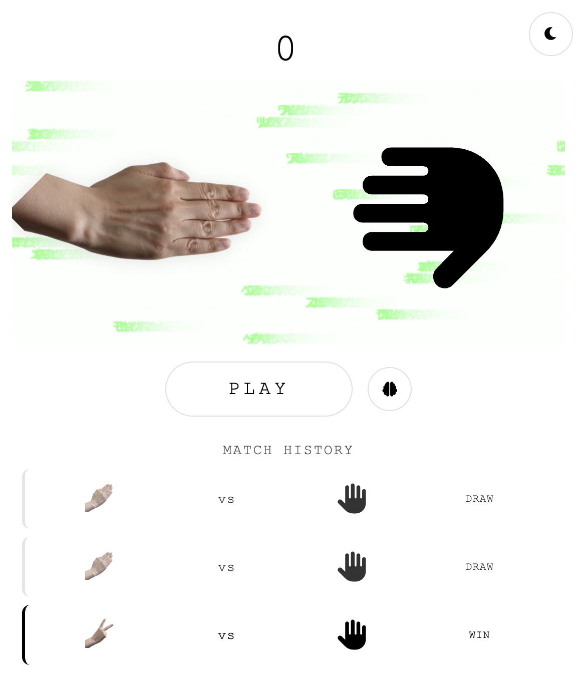
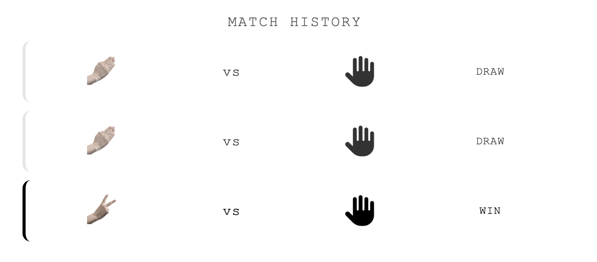

# 🎮 Rock Paper Scissors - LSTM Neural Network Demonstration

<div align="center">
  
  
</div>

An interactive Rock Paper Scissors game that demonstrates the power of **LSTM (Long Short-Term Memory)** neural networks in pattern recognition and prediction. Challenge an AI opponent that learns and adapts to your playing patterns in real-time.


---

## 🎯 Purpose

This project serves as an educational demonstration of **LSTM neural networks** in action. Rather than being a simple random number generator, the AI opponent uses a recurrent neural network to:

- **Learn your patterns**: Analyzes your previous choices to detect behavioral patterns
- **Predict your next move**: Uses LSTM to forecast your upcoming choice based on historical data
- **Adapt its strategy**: Dynamically adjusts its gameplay to counter your predicted moves

The visualization feature allows you to peek inside the LSTM architecture and understand how the neural network processes sequential data to make predictions.

---

## ✨ Features

### 🤖 Intelligent AI Opponent
- **Pattern Recognition**: LSTM network trained on your play history
- **Adaptive Learning**: AI improves its predictions as you play more rounds
- **Real-time Training**: Network retrains after each move with updated patterns

### 📊 Visualization & Analytics
- **Neural Network Diagram**: Interactive LSTM unit visualization showing gates, states, and data flow
- **Match History**: Track your performance with detailed win/loss records
- **Live Statistics**: Monitor score and game progression

### 🎨 User Experience
- **Dark/Light Mode**: Seamless theme switching with persistent preferences
- **Matrix Animation**: Dynamic background effects for enhanced visual appeal
- **Responsive Design**: Fixed game window with optimized layout
- **Smooth Animations**: Polished transitions and interactive feedback

---

## 🛠️ Tech Stack

### Frontend
- **HTML5**: Semantic markup and structure
- **CSS3**: Custom properties, flexbox, animations, and responsive design
- **JavaScript (ES6+)**: Modern JavaScript with async operations

### Machine Learning
- **Brain.js**: Neural network library for JavaScript
  - LSTM (Long Short-Term Memory) implementation
  - Time-step recurrent networks
  - Pattern sequence learning

### Visualization
- **Vis.js Network**: Interactive network graph visualization
- **Canvas API**: Custom matrix animation effects

### UI Components
- **Font Awesome**: Icon library for interface elements
- **Google Fonts**: Montserrat and Courier New typography

---

## 📦 Installation

### Prerequisites
- Python 3.x (for local server)
- Modern web browser (Chrome, Firefox, Safari, Edge)

### Setup Instructions

1. **Clone the repository**
   ```bash
   git clone <repository-url>
   cd rps
   ```

2. **Add the tablecloth image** (optional)
   - Place a `tablecloth.jpg` file in the project root directory
   - This provides the background texture for the game interface

3. **Start the local server**
   ```bash
   python3 -m http.server 8000
   ```

4. **Open in browser**
   ```
   Navigate to: http://localhost:8000
   ```

---

## 🎮 How to Play

1. **Select Your Move**: Click on your hand (left side) to cycle through Rock, Paper, and Scissors
2. **Play**: Click the "Play" button to execute your move
3. **Watch the AI**: The AI displays its counter-move using LSTM predictions
4. **Track Progress**: View your match history below the play button
5. **Explore the Network**: Click the brain icon to visualize the LSTM architecture

### Controls
- **🎨 Theme Toggle**: Top-right corner - Switch between light and dark modes
- **🧠 Brain/History Toggle**: Next to Play button - Switch between match history and neural network visualization

---

## 🧠 How the LSTM Works

### Architecture
The game implements an **LSTM Time-Step** network that processes sequences of your previous moves:

1. **Input Layer**: Your last 10 choices (Rock=1, Paper=2, Scissors=3)
2. **LSTM Layer**:
   - **Forget Gate** (f_t): Decides what information to discard
   - **Input Gate** (i_t): Determines what new information to store
   - **Cell State** (C_t): Long-term memory of patterns
   - **Output Gate** (o_t): Controls what information to output
3. **Output Layer**: Prediction of your next move

### Training Process
```javascript
// Pattern example: [1, 2, 2, 1, 3, 1, 2, 1, 3, 2]
const net = new brain.recurrent.LSTMTimeStep();
net.train([pattern], { iterations: 200, log: false });
const prediction = net.run(pattern);
```

The AI then plays the counter-move to your predicted choice:
- Predicts Rock → AI plays Paper
- Predicts Paper → AI plays Scissors
- Predicts Scissors → AI plays Rock

---

## 📁 Project Structure

```
rps/
├── index.html           # Main HTML structure
├── styles.css           # Styling and animations
├── main.js              # Game logic and LSTM implementation
├── tablecloth.jpg       # Background texture (optional)
└── README.md           # Documentation
```

---

## 🎨 Customization

### Themes
The game includes two themes with CSS custom properties:

```css
:root {
  --bg-color: #ffffff;
  --text-color: #000000;
  --border-color: #e0e0e0;
}

[data-theme="dark"] {
  --bg-color: #0a0a0a;
  --text-color: #e0e0e0;
  --border-color: #2a2a2a;
}
```

### Adjusting AI Difficulty
Modify the pattern length and training iterations in `main.js`:

```javascript
var patternLen = 10;      // Increase for longer memory
net.train([pattern], {
  iterations: 200,        // Increase for better accuracy
  log: false
});
```

---

## 🔬 Educational Use

This project is ideal for:
- **Machine Learning Students**: Understanding LSTM architecture and applications
- **Game Developers**: Implementing AI opponents in games
- **JavaScript Developers**: Working with neural networks in the browser
- **Educators**: Teaching pattern recognition and sequence prediction

---

## 🚀 Future Enhancements

- [ ] Multiple difficulty levels (varying LSTM training iterations)
- [ ] Export/import game statistics
- [ ] Tournament mode with best-of-N rounds
- [ ] Voice commands for hands-free play
- [ ] Multiplayer mode over WebRTC
- [ ] Advanced analytics dashboard

---

## 📝 License

This project is licensed under the MIT License - feel free to use, modify, and distribute.

---

## 🙏 Acknowledgments

- **Brain.js** - Neural network library
- **Vis.js** - Network visualization
- **Font Awesome** - Icon library
- **Wikimedia Commons** - Hand gesture images

---

## 📧 Contact

For questions, suggestions, or contributions, please open an issue or submit a pull request.

---

<div align="center">
  <strong>Built with 🧠 and ❤️</strong>
  <br>
  Demonstrating the power of LSTM neural networks through interactive gameplay
</div>
