# RPS


---

## Abstract

Rock Paper Scissors occupies a paradoxical position in formal game theory: trivially simple to describe, yet provably unsolvable by any pure deterministic strategy. This property makes it a minimal but complete substrate for demonstrating the full breadth of modern AI -- every technique that attempts to beat a human opponent must grapple with uncertainty, temporal dependence, adversarial dynamics, and psychological bias. This project uses an interactive RPS game as a living laboratory for those concepts, currently implementing an LSTM neural network as the AI opponent, with a map of 20 additional AI frameworks the game naturally demonstrates.

---

## The Game as a Mathematical Object

The payoff matrix $A$ for a two-player zero-sum formulation:

$$A = \begin{pmatrix} 0 & -1 & +1 \\ +1 & 0 & -1 \\ -1 & +1 & 0 \end{pmatrix}$$

where rows are the human's moves $\{R, P, S\}$ and columns are the AI's moves. Every entry pair sums to zero, confirming the zero-sum property. The cyclic dominance structure means no row strictly dominates another, so no pure strategy can be optimal.

---

## Concept Index

| # | Concept | Category |
|---|---------|----------|
| 1 | [LSTM](#1-lstm) | Deep Learning |
| 2 | [GRU](#2-gru) | Deep Learning |
| 3 | [Transformer Attention](#3-transformer-attention) | Deep Learning |
| 4 | [Markov Chains](#4-markov-chains) | Probabilistic |
| 5 | [Hidden Markov Models](#5-hidden-markov-models) | Probabilistic |
| 6 | [Bayesian Inference](#6-bayesian-inference) | Probabilistic |
| 7 | [Thompson Sampling](#7-thompson-sampling) | Probabilistic / RL |
| 8 | [Nash Equilibrium](#8-nash-equilibrium) | Game Theory |
| 9 | [Minimax Algorithm](#9-minimax-algorithm) | Game Theory |
| 10 | [Von Neumann Minimax Theorem](#10-von-neumann-minimax-theorem) | Game Theory |
| 11 | [Folk Theorem](#11-folk-theorem) | Game Theory |
| 12 | [Q-Learning](#12-q-learning) | Reinforcement Learning |
| 13 | [Policy Gradient](#13-policy-gradient) | Reinforcement Learning |
| 14 | [Multi-Armed Bandits](#14-multi-armed-bandits) | Reinforcement Learning |
| 15 | [Frequency Analysis](#15-frequency-analysis) | Statistics |
| 16 | [Entropy and Information Theory](#16-entropy-and-information-theory) | Statistics |
| 17 | [Law of Large Numbers / CLT](#17-law-of-large-numbers-and-clt) | Statistics |
| 18 | [Monte Carlo Methods](#18-monte-carlo-methods) | Simulation |
| 19 | [Ensemble Methods](#19-ensemble-methods) | ML Systems |
| 20 | [Cognitive Biases](#20-cognitive-biases) | Psychology |

---

## 1. LSTM

**Current implementation.** Long Short-Term Memory networks learn dependencies in sequences. The input sequence is the player's last $T$ moves encoded as integers $x_t \in \{1, 2, 3\}$.

$$f_t = \sigma(W_f [h_{t-1}, x_t] + b_f)$$
$$i_t = \sigma(W_i [h_{t-1}, x_t] + b_i)$$
$$\tilde{C}_t = \tanh(W_C [h_{t-1}, x_t] + b_C)$$
$$C_t = f_t \odot C_{t-1} + i_t \odot \tilde{C}_t$$
$$o_t = \sigma(W_o [h_{t-1}, x_t] + b_o)$$
$$h_t = o_t \odot \tanh(C_t)$$

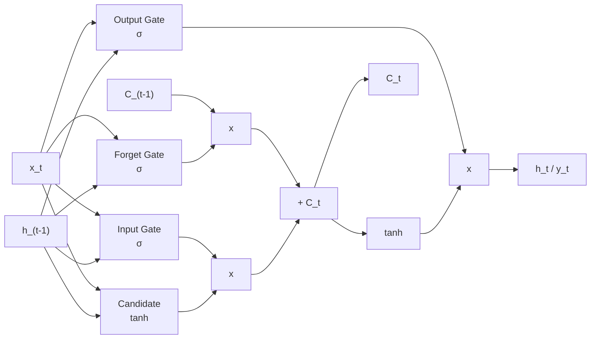
```mermaid
flowchart LR
    xt["x_t"] --> fg["Forget Gate\nσ"]
    xt --> ig["Input Gate\nσ"]
    xt --> cg["Candidate\ntanh"]
    xt --> og["Output Gate\nσ"]
    ht1["h_(t-1)"] --> fg
    ht1 --> ig
    ht1 --> cg
    ht1 --> og
    Ct1["C_(t-1)"] --> mul1["x"]
    fg --> mul1
    ig --> mul2["x"]
    cg --> mul2
    mul1 --> add["+ C_t"]
    mul2 --> add
    add --> tanh2["tanh"]
    og --> mul3["x"]
    tanh2 --> mul3
    mul3 --> ht["h_t / y_t"]
    add --> Ct["C_t"]
```

The AI plays the counter-move to the predicted $\hat{y}_t$: predicted Rock yields Paper, Paper yields Scissors, Scissors yields Rock.

---

## 2. GRU

The Gated Recurrent Unit removes the separate cell state, reducing parameters while retaining sequence modeling capacity.

$$z_t = \sigma(W_z [h_{t-1}, x_t])$$
$$r_t = \sigma(W_r [h_{t-1}, x_t])$$
$$\tilde{h}_t = \tanh(W [r_t \odot h_{t-1}, x_t])$$
$$h_t = (1 - z_t) \odot h_{t-1} + z_t \odot \tilde{h}_t$$

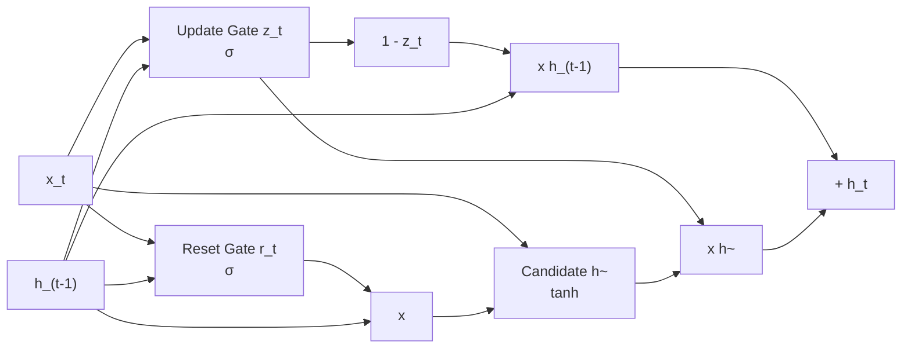
```mermaid
flowchart LR
    xt["x_t"] --> zg["Update Gate z_t\nσ"]
    xt --> rg["Reset Gate r_t\nσ"]
    xt --> cand["Candidate h~\ntanh"]
    ht1["h_(t-1)"] --> zg
    ht1 --> rg
    rg --> mulr["x"]
    ht1 --> mulr
    mulr --> cand
    zg --> inv["1 - z_t"]
    inv --> mulh["x h_(t-1)"]
    ht1 --> mulh
    zg --> mulc["x h~"]
    cand --> mulc
    mulh --> sum["+ h_t"]
    mulc --> sum
```

Relative to LSTM: GRU has no $C_t$, two gates instead of three, and trains approximately 25% faster on short sequences (T <= 20).

---

## 3. Transformer Attention

Attention replaces recurrence entirely. Each position in the move history attends to all others, producing a context vector via scaled dot-product attention.

$$\text{Attention}(Q, K, V) = \text{softmax}\!\left(\frac{QK^\top}{\sqrt{d_k}}\right) V$$

where $Q = x W_Q$, $K = x W_K$, $V = x W_V$ are learned linear projections of the move sequence $x$.

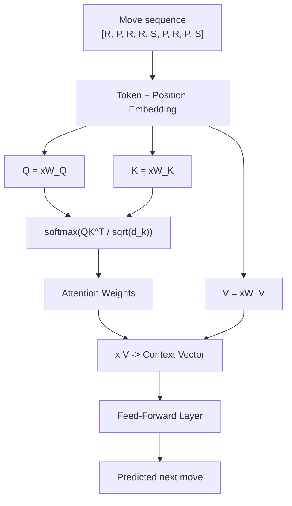
```mermaid
flowchart TD
    seq["Move sequence\n[R, P, R, R, S, P, R, P, S]"] --> emb["Token + Position Embedding"]
    emb --> Q["Q = xW_Q"]
    emb --> K["K = xW_K"]
    emb --> V["V = xW_V"]
    Q --> attn["softmax(QK^T / sqrt(d_k))"]
    K --> attn
    attn --> weight["Attention Weights"]
    weight --> ctx["x V  ->  Context Vector"]
    V --> ctx
    ctx --> ff["Feed-Forward Layer"]
    ff --> pred["Predicted next move"]
```

Multi-head attention runs $h$ parallel attention functions, then concatenates: $\text{MultiHead}(Q,K,V) = \text{Concat}(\text{head}_1,\ldots,\text{head}_h)W^O$.

---

## 4. Markov Chains

A first-order Markov chain models the move sequence under the assumption $P(x_t \mid x_{t-1}, \ldots, x_1) = P(x_t \mid x_{t-1})$. The empirical transition matrix $\hat{T}$ is:

$$\hat{T}_{ij} = \frac{\text{count}(x_{t-1} = i,\; x_t = j)}{\text{count}(x_{t-1} = i)}$$

An $n$-th order extension conditions on the last $n$ moves, approximating a high-order Markov model and converging toward the LSTM's learned representation as $n$ increases.

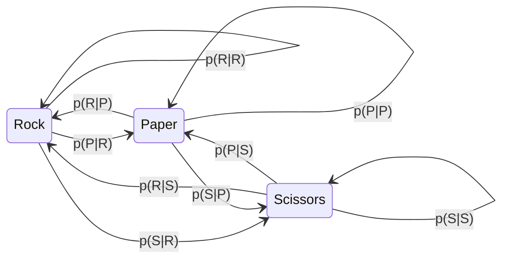
```mermaid
stateDiagram-v2
    direction LR
    Rock --> Rock : p(R|R)
    Rock --> Paper : p(P|R)
    Rock --> Scissors : p(S|R)
    Paper --> Rock : p(R|P)
    Paper --> Paper : p(P|P)
    Paper --> Scissors : p(S|P)
    Scissors --> Rock : p(R|S)
    Scissors --> Paper : p(P|S)
    Scissors --> Scissors : p(S|S)
```

---

## 5. Hidden Markov Models

An HMM introduces latent states $z_t$ (unobserved player "strategy modes") that generate observed moves $x_t$.

$$P(x_{1:T}, z_{1:T}) = P(z_1) \prod_{t=2}^{T} P(z_t \mid z_{t-1}) \prod_{t=1}^{T} P(x_t \mid z_t)$$

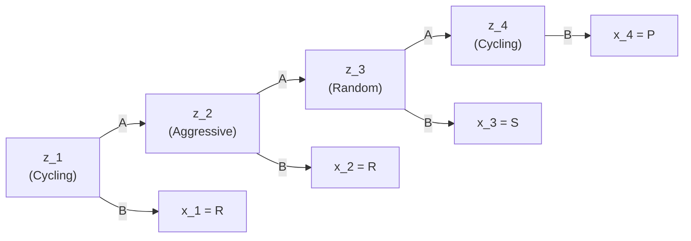
```mermaid
flowchart LR
    z1["z_1\n(Cycling)"] -->|"A"| z2["z_2\n(Aggressive)"]
    z2 -->|"A"| z3["z_3\n(Random)"]
    z3 -->|"A"| z4["z_4\n(Cycling)"]
    z1 -->|"B"| x1["x_1 = R"]
    z2 -->|"B"| x2["x_2 = R"]
    z3 -->|"B"| x3["x_3 = S"]
    z4 -->|"B"| x4["x_4 = P"]
```

$A$ is the transition matrix over hidden states; $B$ is the emission matrix. Inference uses the **Viterbi algorithm** $O(K^2 T)$ for the most likely state sequence, and **Baum-Welch** (EM) to learn $A$ and $B$ from observed data.

---

## 6. Bayesian Inference

Model the opponent's move distribution as a categorical with a Dirichlet prior:

$$\theta \sim \text{Dir}(\alpha_R, \alpha_P, \alpha_S)$$
$$x_t \mid \theta \sim \text{Categorical}(\theta)$$

The posterior after $n_R, n_P, n_S$ observed moves is:

$$\theta \mid x_{1:T} \sim \text{Dir}(\alpha_R + n_R,\; \alpha_P + n_P,\; \alpha_S + n_S)$$

The posterior predictive is simply $\hat{p}_i = (\alpha_i + n_i) / (\sum_j \alpha_j + T)$. The AI plays the counter to $\arg\max_i \hat{p}_i$.

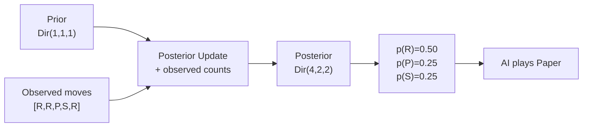
```mermaid
flowchart LR
    prior["Prior\nDir(1,1,1)"] --> update["Posterior Update\n+ observed counts"]
    obs["Observed moves\n[R,R,P,S,R]"] --> update
    update --> post["Posterior\nDir(4,2,2)"]
    post --> pred["p(R)=0.50\np(P)=0.25\np(S)=0.25"]
    pred --> ai["AI plays Paper"]
```

---

## 7. Thompson Sampling

Maintain independent Beta posteriors over the win probability of each AI move $a$:

$$\theta_a \sim \text{Beta}(\alpha_a, \beta_a)$$

At each round, sample $\tilde{\theta}_a \sim \text{Beta}(\alpha_a, \beta_a)$ for each action and play $a^* = \arg\max_a \tilde{\theta}_a$. After observing outcome $r \in \{0, 1\}$:

$$\alpha_{a^*} \leftarrow \alpha_{a^*} + r, \quad \beta_{a^*} \leftarrow \beta_{a^*} + (1 - r)$$

Thompson Sampling is Bayes-optimal for the Bernoulli bandit and achieves $O(\sqrt{KT \log T})$ regret asymptotically.

---

## 8. Nash Equilibrium

A mixed strategy Nash Equilibrium is a profile $(\sigma^*, \tau^*)$ such that neither player gains by unilateral deviation:

$$\mathbb{E}[\text{payoff} \mid \sigma^*, \tau^*] \geq \mathbb{E}[\text{payoff} \mid \sigma, \tau^*] \quad \forall \sigma$$

For RPS the unique Nash Equilibrium is:

$$\sigma^* = \tau^* = \left(\tfrac{1}{3}, \tfrac{1}{3}, \tfrac{1}{3}\right)$$

with game value $v = 0$. Any deviation from $\sigma^*$ by one player is immediately exploitable by the other. This is the theoretical ceiling: an AI playing Nash cannot be beaten in expectation, but also cannot beat a Nash-playing human. Exploiting human bias requires deliberately deviating from Nash.

---

## 9. Minimax Algorithm

In a two-player zero-sum game the minimax value is:

$$v = \max_\sigma \min_\tau \; \sigma^\top A \tau$$

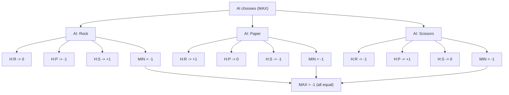
```mermaid
graph TD
    root["AI chooses (MAX)"]
    root --> r["AI: Rock"]
    root --> p["AI: Paper"]
    root --> s["AI: Scissors"]
    r --> rr["H:R -> 0"]
    r --> rp["H:P -> -1"]
    r --> rs["H:S -> +1"]
    p --> pr["H:R -> +1"]
    p --> pp["H:P -> 0"]
    p --> ps["H:S -> -1"]
    s --> sr["H:R -> -1"]
    s --> sp["H:P -> +1"]
    s --> ss["H:S -> 0"]
    r --> minr["MIN = -1"]
    p --> minp["MIN = -1"]
    s --> mins["MIN = -1"]
    minr --> maxv["MAX = -1  (all equal)"]
    minp --> maxv
    mins --> maxv
```

All branches have the same minimax value $-1$, confirming that no deterministic pure strategy dominates. The deterministic minimax reduces to Nash, and a randomized best response mixes uniformly.

---

## 10. Von Neumann Minimax Theorem

**Theorem (Von Neumann, 1928).** For any finite two-player zero-sum game with payoff matrix $A \in \mathbb{R}^{m \times n}$:

$$\max_{x \in \Delta_m} \min_{y \in \Delta_n} x^\top A y \;=\; \min_{y \in \Delta_n} \max_{x \in \Delta_m} x^\top A y \;=\; v$$

where $\Delta_m, \Delta_n$ are the probability simplices over the players' action sets.

For RPS, $A$ is the $3 \times 3$ antisymmetric matrix above, and the unique saddle point is $x^* = y^* = (1/3, 1/3, 1/3)^\top$ with $v = 0$. The theorem guarantees existence of this saddle point for all finite zero-sum games and is the foundation for all adversarial AI.

---

## 11. Folk Theorem

In an infinitely repeated game with discount factor $\delta \in (0,1)$, each player's continuation value from round $t$ is $V_t = \sum_{k=0}^\infty \delta^k r_{t+k}$.

**Folk Theorem (informal).** Any payoff vector $u$ that Pareto-dominates the minimax payoff $\bar{v}$ can be sustained as a subgame-perfect Nash Equilibrium when $\delta$ is sufficiently close to 1.

In RPS this means: when both players care about future rounds (high $\delta$), patterns across rounds act as a signaling channel. A player who deviates from an implicit pattern-based "agreement" can be punished in subsequent rounds. The LSTM exploits exactly this channel -- it detects the implicit structure a human player builds over many rounds.

---

## 12. Q-Learning

Q-Learning learns the action-value function $Q : \mathcal{S} \times \mathcal{A} \to \mathbb{R}$ without a model of the environment.

$$Q(s, a) \leftarrow Q(s, a) + \alpha \left[ r + \gamma \max_{a'} Q(s', a') - Q(s, a) \right]$$

In RPS: $s$ is the last $n$ moves, $\mathcal{A} = \{R, P, S\}$, $r \in \{+1, 0, -1\}$.

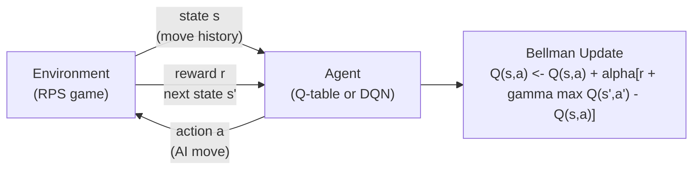
```mermaid
flowchart LR
    env["Environment\n(RPS game)"] -->|"state s\n(move history)"| agent["Agent\n(Q-table or DQN)"]
    agent -->|"action a\n(AI move)"| env
    env -->|"reward r\nnext state s'"| agent
    agent --> update["Bellman Update\nQ(s,a) <- Q(s,a) + alpha[r + gamma max Q(s',a') - Q(s,a)]"]
```

Deep Q-Networks (DQN) replace the table with a neural network $Q_\theta(s,a)$, enabling generalization over the exponentially large state space of long move histories.

---

## 13. Policy Gradient

Policy gradient methods directly parameterize the policy $\pi_\theta(a \mid s)$ and optimize expected cumulative reward $J(\theta) = \mathbb{E}_{\pi_\theta}\left[\sum_t r_t\right]$.

**REINFORCE gradient estimator:**

$$\nabla_\theta J(\theta) = \mathbb{E}_{\pi_\theta}\left[\sum_t \nabla_\theta \log \pi_\theta(a_t \mid s_t) \cdot G_t\right]$$

where $G_t = \sum_{k \geq t} \gamma^{k-t} r_k$ is the return from step $t$.

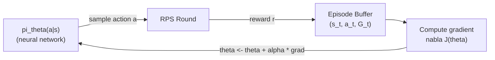
```mermaid
flowchart LR
    policy["pi_theta(a|s)\n(neural network)"] -->|"sample action a"| game["RPS Round"]
    game -->|"reward r"| buffer["Episode Buffer\n(s_t, a_t, G_t)"]
    buffer --> grad["Compute gradient\nnabla J(theta)"]
    grad -->|"theta <- theta + alpha * grad"| policy
```

A baseline $b(s)$ (e.g., value function $V(s)$) reduces gradient variance: replace $G_t$ with $G_t - b(s_t)$, yielding the **Actor-Critic** family.

---

## 14. Multi-Armed Bandits

The bandit formulation treats each move as an arm with unknown win-rate distribution. UCB1 balances exploration and exploitation:

$$a_t = \arg\max_{a \in \mathcal{A}} \left[ \hat{\mu}_a + C \sqrt{\frac{\ln t}{n_a}} \right]$$

where $\hat{\mu}_a$ is the empirical win rate of move $a$, $n_a$ is the number of times it was played, $t$ is the total round count, and $C$ is an exploration constant. UCB1 achieves $O(\sqrt{KT \log T})$ cumulative regret.

Bandits ignore temporal structure and thus underperform Markov and LSTM models when the opponent has sequential patterns. They are optimal only when rounds are i.i.d.

---

## 15. Frequency Analysis

The simplest viable AI: estimate the opponent's marginal move distribution and play the counter to the mode.

$$\hat{p}_i = \frac{n_i}{T}, \quad a^* = \text{counter}\!\left(\arg\max_i \hat{p}_i\right)$$

A first-order extension builds the empirical transition matrix $\hat{T}_{ij}$ and plays $\text{counter}(\arg\max_j \hat{T}_{x_{t-1}, j})$. This is a maximum-likelihood Markov predictor with $n=1$.

---

## 16. Entropy and Information Theory

Shannon entropy of the opponent's move distribution measures exploitability:

$$H(X) = -\sum_{i \in \{R,P,S\}} p_i \log_2 p_i$$

The maximum $H = \log_2 3 \approx 1.585$ bits is achieved by the Nash strategy $(1/3, 1/3, 1/3)$ -- zero exploitability. Any deviation from uniform lowers $H$ and creates exploitable structure.

Mutual information between consecutive moves quantifies how much the current move predicts the next:

$$I(X_t;\, X_{t+1}) = H(X_{t+1}) - H(X_{t+1} \mid X_t)$$

High $I$ means a Markov predictor will perform well; low $I$ (near-random play) means sequence models add little over frequency analysis.

---

## 17. Law of Large Numbers and CLT

**Strong LLN.** Let $W_n$ be the number of wins in $n$ rounds under the Nash strategy. Then:

$$\frac{W_n}{n} \xrightarrow{a.s.} \frac{1}{3} \quad \text{as } n \to \infty$$

**CLT.** The standardized win rate converges in distribution:

$$\frac{W_n/n - 1/3}{\sqrt{2/(9n)}} \xrightarrow{d} \mathcal{N}(0, 1)$$

A 95% confidence interval for the true win rate after $n$ rounds is:

$$\hat{p} \pm 1.96 \sqrt{\frac{\hat{p}(1-\hat{p})}{n}}$$

This is the principled way to determine whether an AI's edge over a human is statistically significant rather than due to sampling variance.

---

## 18. Monte Carlo Methods

Monte Carlo win-rate estimation: sample $M$ episodes from the empirical opponent model, simulate outcomes, and compute:

$$\hat{v}(a) = \frac{1}{M} \sum_{m=1}^M r_m^{(a)}, \quad \text{Var}(\hat{v}) = O(1/M)$$

**Monte Carlo Tree Search** in RPS reduces to a one-ply search (the game has no future branching once the current move is chosen), making MCTS equivalent to frequency analysis at depth 1. At depth $d > 1$ (iterated or tournament play), MCTS selects nodes by UCB:

$$\text{UCB}(v) = \frac{w_v}{n_v} + C \sqrt{\frac{\ln n_{\text{parent}}}{n_v}}$$

---

## 19. Ensemble Methods

An ensemble AI combines $K$ base predictors, each trained on a different model class, with weights $\lambda_k$ tuned by recent accuracy:

$$\hat{y} = \text{counter}\!\left(\arg\max_i \sum_{k=1}^K \lambda_k \hat{p}_k(i)\right)$$

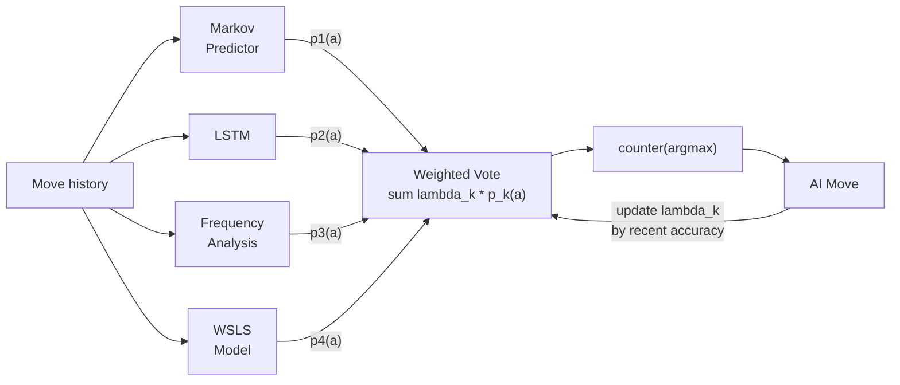
```mermaid
flowchart LR
    h["Move history"] --> m1["Markov\nPredictor"]
    h --> m2["LSTM"]
    h --> m3["Frequency\nAnalysis"]
    h --> m4["WSLS\nModel"]
    m1 -->|"p1(a)"| vote["Weighted Vote\nsum lambda_k * p_k(a)"]
    m2 -->|"p2(a)"| vote
    m3 -->|"p3(a)"| vote
    m4 -->|"p4(a)"| vote
    vote --> counter["counter(argmax)"]
    counter --> ai["AI Move"]
    ai -->|"update lambda_k\nby recent accuracy"| vote
```

Weights $\lambda_k$ update by exponential moving average of each model's recent prediction accuracy, implementing a form of online meta-learning.

---

## 20. Cognitive Biases

Human move sequences are not i.i.d. uniform. Several biases create exploitable structure:

**Win-Stay Lose-Shift (WSLS).** Empirically documented tendency:

$$P(\text{repeat} \mid \text{win}) > 1/3, \quad P(\text{switch} \mid \text{loss}) > 2/3$$

**Gambler's Fallacy.** After $k$ consecutive identical moves, $P(\text{switch})$ increases with $k$ even though the correct probability is unchanged. Formally, humans act as if moves are draws without replacement.

**Recency Bias.** Humans over-weight recent history. An exponential decay model captures this:

$$\hat{p}_t(i) \propto \sum_{\tau=1}^{T} \lambda^{T-\tau} \mathbf{1}[x_\tau = i], \quad \lambda \in (0, 1)$$

**Entropy implication.** Each bias lowers $H(X_t \mid \text{context})$ below $\log_2 3$, increasing the mutual information exploitable by a sequence model.

---

## Implementation

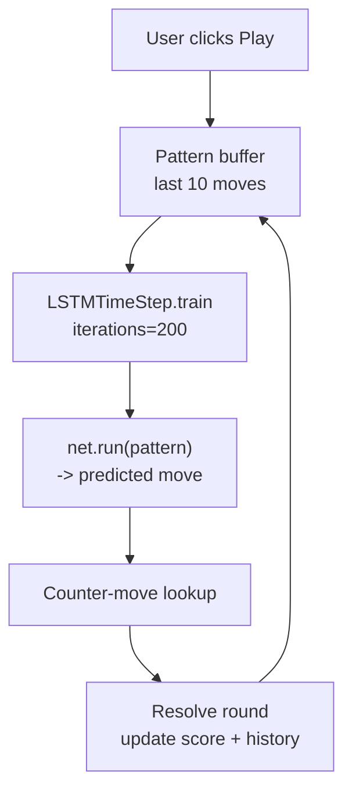
```mermaid
flowchart TD
    click["User clicks Play"] --> buf["Pattern buffer\nlast 10 moves"]
    buf --> train["LSTMTimeStep.train\niterations=200"]
    train --> run["net.run(pattern)\n-> predicted move"]
    run --> counter["Counter-move lookup"]
    counter --> resolve["Resolve round\nupdate score + history"]
    resolve --> buf
```

**Files**

| File | Role |
|------|------|
| `index.html` | UI structure |
| `main.js` | Game logic, LSTM AI, network visualization |
| `styles.css` | Themes, animations |

**Running locally**

```bash
git clone https://github.com/a12n4v/rps.git
cd rps
python3 -m http.server 8000
# open http://localhost:8000
```

---

## Further Reading

- Von Neumann and Morgenstern -- *Theory of Games and Economic Behavior* (1944)
- Hochreiter and Schmidhuber -- *Long Short-Term Memory*, Neural Computation (1997)
- Sutton and Barto -- *Reinforcement Learning: An Introduction* (2nd ed., 2018)
- Shannon -- *A Mathematical Theory of Communication*, Bell System Technical Journal (1948)
- Aumann -- *Repeated Games*, Nobel Lecture (2005)

---

MIT License
